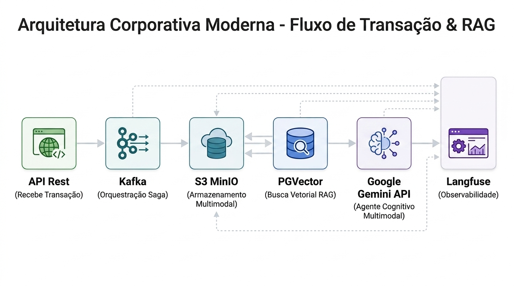

<div align="center">



<br/>

[](https://www.linkedin.com/)
[](https://twitter.com/)

[Português](#) | [English](#) | [Español](#)

<br/>

# 🌟 Workshop Spring AI - WTEC 2026

**100+ AI Agents & RAG apps you can actually run — clone, customize, ship.** <br>
*Detecção de Fraudes com LLMs, RAG, Visão Computacional e Agentes Autônomos em Spring Boot.*

[](https://github.com/joelmaykon94/workshop-spring-ai/stargazers)
[](https://github.com/joelmaykon94/workshop-spring-ai/network/members)
[](https://github.com/joelmaykon94/workshop-spring-ai/graphs/contributors)
[](https://opensource.org/licenses/Apache-2.0)
[](#)

<br/>

[](#-como-iniciar-a-prática-passo-a-passo)
[](#-o-desafio-hands-on)
[](#-o-desafio-hands-on)

<br/>

[]()

</div>

---

## 💡 Por que este projeto existe?

Você não precisaria ter que reconstruir o mesmo pipeline RAG, loop de agente ou integração com ferramentas do zero a cada novo projeto corporativo com LLMs.

**O Workshop Spring AI - WTEC 2026** é um "cookbook" de arquiteturas avançadas pronto para uso - código base que você pode clonar, personalizar e aplicar em produção. O objetivo é demonstrar a transição de APIs CRUD tradicionais para **Agentes Cognitivos Multimodais** capazes de correlacionar metadados, fotos de cupons fiscais e áudios de autorização.

* 🛠️ **Construído à mão, não gerado** - Cada fluxo de agente é original e reflete um caso de uso real testado de ponta a ponta.
* 🚀 **Roda em poucos comandos** - Sem "se vira aí" para subir a infraestrutura. Tudo automatizado no Dev Containers e Docker Compose.
* 🧠 **Cobre a stack de IA moderna** - Agentes Cognitivos, Ferramentas de IA (Tools/Functions), Visão Multimodal, Áudio, RAG (Vector Stores) e Observabilidade com Langfuse.

---

## 🚀 Ambiente (Docker / Dev Containers)

Este projeto foi otimizado para rodar localmente utilizando Docker Compose ou VS Code Dev Containers. A infraestrutura subirá **automaticamente** os serviços de banco e mensageria (PostgreSQL, Kafka, MinIO e Langfuse).

1. **Como verificar se os containers subiram:**
   Abra o seu terminal local e execute:
   ```bash
   docker ps
   ```

2. **Configurando a API da IA (Google Gemini 1.5 Flash):**
   Para manter o ambiente de desenvolvimento extremamente rápido e leve, o projeto está configurado para usar a API gratuita do Google Gemini em vez de processamento de modelos locais na GPU.
   - Crie uma chave de API grátis no [Google AI Studio](https://aistudio.google.com/app/apikey).
   
3. **Obtendo as chaves do Langfuse:**
   - Acesse o painel do Langfuse em `http://localhost:3000`.
   - Crie uma conta de teste inicial para login.
   - No fluxo de boas-vindas, crie uma organização (ex: `org-teste`) e depois um projeto (ex: `projeto-teste`).
   - A tela inicial de "Setup Tracing" será exibida com a opção de copiar a **Public Key**, **Secret Key** e **Host**.

4. **Configurando as Variáveis de Ambiente:**
   - Na raiz do projeto, duplique o arquivo `.env.example` e renomeie-o para `.env`.
   - Abra o arquivo `.env` e preencha as variáveis de ambiente com as chaves obtidas (`OPENAI_API_KEY` do Google AI Studio, e as chaves `LANGFUSE_PUBLIC_KEY` e `LANGFUSE_SECRET_KEY` do Langfuse).

5. **Executando a Aplicação:**
   - Com o arquivo `.env` configurado e salvo, basta iniciar a aplicação pelo terminal:
   ```bash
   ./mvnw spring-boot:run
   ```

*(O projeto já está configurado para apontar automaticamente para o `localhost` para conectar ao Postgres, Kafka e MinIO de forma transparente!)*

---

## 📊 Dashboards Web

Com os containers ativos, acesse os painéis no seu navegador:
*   **Langfuse (http://localhost:3000):** Painel de Observabilidade dos Prompts da IA. Crie uma conta local e gere suas chaves em Settings > API Keys.
*   **MinIO (http://localhost:9001):** Nosso "S3" local. Login: `minioadmin / minioadmin`.

---

## 🚀 Como Iniciar a Prática (Passo a Passo)

Para garantir que você consiga codificar e salvar suas alterações sem problemas de permissão, siga a ordem abaixo:

### Passo 1: Fazer Fork do Repositório (Obrigatório)
1. Estando nesta página, clique no botão **Fork** no canto superior direito do GitHub.
2. Certifique-se de **desmarcar** a opção *"Copy the main branch only"* (Copiar apenas a branch main), pois precisaremos tanto da branch `main` quanto da branch `solucao` durante a prática.
3. Isso criará uma cópia idêntica deste projeto em sua conta pessoal do GitHub (ex: `github.com/seu-usuario/workshop-spring-ai-wtec-2026-1`).

### Passo 2: Inicializar o Ambiente Local
1. Clone o repositório para sua máquina local (ex: `git clone https://github.com/seu-usuario/workshop-spring-ai-wtec-2026-1.git`).
2. Abra a pasta do projeto no **Visual Studio Code**.
3. Se você tiver a extensão **Dev Containers** instalada, um aviso aparecerá: **"Reopen in Container"**. Clique nele. Isso configurará o Java 21 e as extensões no VS Code sem precisar instalar nada na sua máquina física!

---

## 🛠️ Orquestração Automática

Para subir a infraestrutura base de dados e mensageria, execute o comando abaixo na raiz do projeto:
```bash
docker compose up -d
```
Isso iniciará:
- **PostgreSQL** com a extensão `pgvector` (Para RAG).
- **MinIO** (Armazenamento S3 para recibos).
- **Kafka** (Mensageria assíncrona para orquestração da Saga).
- **Langfuse** (Painel web para observabilidade da Inteligência Artificial).

---

## 🧪 Testando a API (cURL)

Para facilitar os testes práticos durante o workshop, preparamos uma pasta `test-data/` contendo diferentes cenários de transações e comprovantes reais (anonimizados).

### Setup do MinIO (Obrigatório)
Antes de rodar os testes, é necessário enviar as imagens para o bucket `fraud-images` no MinIO (para simular um upload de um app). Execute os comandos abaixo em um terminal:
```bash
docker cp test-data/itau_uni.png fraud-minio:/tmp/
docker exec fraud-minio mc cp /tmp/itau_uni.png myminio/fraud-images/itau_uni.png

docker cp test-data/receipt_b_dot.png fraud-minio:/tmp/
docker exec fraud-minio mc cp /tmp/receipt_b_dot.png myminio/fraud-images/receipt_b_dot.png
```

### 1. Cenário: Transação Legítima
Testa uma transação normal, referenciando o comprovante `itau_uni.png`. O Agente IA deve deduzir que não é fraude.
```bash
curl -X POST -H "Content-Type: application/json" -d @test-data/payload-itau-legitimo.json http://localhost:8080/api/fraud/analyze
```

### 2. Cenário: Transação Fraudulenta
Testa uma transação suspeita, referenciando o `receipt_b_dot.png`. O Agente IA deve bloquear (isFraud: true) e acionar a Saga de Compensação.
```bash
curl -X POST -H "Content-Type: application/json" -d @test-data/payload-receipt-falso.json http://localhost:8080/api/fraud/analyze
```

### 3. Semeando Dados no RAG (Vector Store)
Para popular o histórico de conhecimento da aplicação com uma transação:
```bash
curl -X POST -H "Content-Type: application/json" -d @test-data/test-payload.json http://localhost:8080/api/fraud/seed
```

---

## 📝 O Desafio Hands-on
O repositório na branch `main` contém a estrutura de controllers e modelos pronta, mas as regras de busca vetorial e injeção multimodal estão vazias. Seu objetivo durante o minicurso é:
1. Implementar a busca semântica em **`VectorSearchService.java`**.
2. Configurar o **`ChatClient`** com Advisors de memória/RAG e Tools no **`FraudDetectionAgent.java`**.
3. Construir o fluxo multimodal de processamento de imagem de cupons e áudio no agente.

Se precisar de ajuda ou ficar travado, consulte o código completo na branch **`solucao`**.

---

## 📚 Referências e Documentações

Para aprofundamento durante e após o workshop, consulte a documentação oficial das ferramentas que utilizamos:

*   **Spring AI**
    *   [Visão Geral do Spring AI](https://spring.io/projects/spring-ai#overview)
    *   [API do ChatClient (Prompts e Chamadas)](https://docs.spring.io/spring-ai/reference/api/chatclient.html)
    *   [Bancos de Dados Vetoriais (PGVector)](https://docs.spring.io/spring-ai/reference/api/vectordbs.html)
    *   [Multimodalidade (Visão e Áudio)](https://docs.spring.io/spring-ai/reference/api/multimodality.html)
*   **Inteligência Artificial**
    *   [Google AI Studio (Gemini API)](https://aistudio.google.com/)
*   **Infraestrutura e Observabilidade**
    *   [Langfuse (LLM Observability)](https://langfuse.com/docs)
    *   [Apache Kafka (Saga Pattern)](https://kafka.apache.org/documentation/)
    *   [MinIO (Object Storage S3)](https://min.io/docs/minio/linux/index.html)